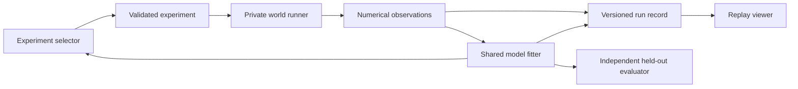

# Implementation plan

Status: proposal. Architecture and infrastructure decisions are being reviewed.
Only planning documents and repository metadata exist at this stage. See
[open design decisions](DESIGN_DECISIONS.md) before treating a choice below as final.

## Objective

Build a reproducible benchmark and visual laboratory around this question:

> Under a fixed number of interventions, which experiment-selection strategies
> learn predictive rules that generalize, and recover when those rules change?

Research correctness takes priority over interface breadth. A negative result for
the LLM is a valid outcome. Do not design the suite to make one method win.

## Scope of version 0.1

- Two-dimensional motion in dimensionless units; initially one movable particle
  and one fixed anchor or field source. This is sufficient to identify the three
  force families without introducing collisions or many-body instability.
- Three families with hidden coefficients, including terms that may be absent.
- Known mass, initial conditions, applied impulse and observation timing.
- Numerical position and velocity observations with controlled sensor noise.
- A fixed budget, a stationary control condition, and at most one unannounced
  change between experiments. Resetting the particle does not reset the law.
- Three experiment selectors sharing a model fitter and adaptation policy.
- Offline CLI evaluation, versioned run records, and a browser replay viewer.
- A constrained world builder: supported primitives and coefficient ranges.
  Free-form equations and arbitrary executable code come later.

## Architecture

The Python simulator is the sole authority on physics. The eventual browser
interpolates recorded frames; it does not implement a second physics engine.

### Core and contracts

Keep the initial package small: dataclasses, a force-law interface, fixed-step
RK4, a budget-enforcing session, and seeded random exploration. Add NumPy and
SciPy when implementing fitting. Keep all dependencies locked with uv.

The proposed initial code is a trusted local scaffold. Before running an LLM, introduce
separate runner and agent processes with serialized messages. Agent processes
must not receive hidden configurations, evaluator files, seeds that reconstruct
worlds, or filesystem/shell access to them. A Python private attribute alone is
not a research isolation boundary.

Proposed agent-facing operations:

- `describe_space()` returns legal interventions, units, timing and budget.
- `run_experiment(spec)` returns timestamped observations and remaining budget.
- `fit_model()` fits only observations already purchased from the budget.
- `predict(spec)` evaluates the current fitted model, never the true simulator.
- `submit_model()` stores a serializable model snapshot for offline evaluation.

Each selected experiment includes a concise, public rationale and optional
testable hypothesis. Treat these as annotations, not evidence of correctness.

### Inference

Use sparse regression over a disclosed feature dictionary and fit integrated
velocity increments to avoid numerically differentiating noisy observations.
Choose regularization and numerical settings on development worlds. For radial
fields, compare a small, disclosed exponent grid; do not secretly give the fitter
the correct exponent. Use bootstrap resampling of whole experiments for an
ensemble, since samples within a trajectory are correlated.

All selectors share that fitter, its feature library, its fit budget and its
change-handling policy. Ensemble disagreement is an acquisition heuristic;
predictive interval coverage must be measured rather than assumed.

Later add a separate model-discovery track using a bounded expression grammar
with numerical validation. Do not execute generated Python to evaluate models.
Report this track separately because changing both selection and model class
would confound the primary comparison.

### Adaptation

Use standardized pre-experiment prediction residuals to update a change detector.
After a validated alarm, reset or down-weight old observations according to a
predeclared policy. Implement an all-history policy, a fixed sliding window, and
a detector-triggered reset as explicit ablations, not ad hoc rescues.

Calibrate detector thresholds and interval construction on development worlds,
including stationary controls. A true change marker exists only in evaluator
metadata and becomes visible to people in the completed replay.

### Viewer and world builder

Use TypeScript, React, Vite and Canvas 2D when the replay format settles. Begin
with file import and bundled, clearly labeled example runs. The first screen
shows actual and predicted trajectories, uncertainty bands, budget, public
hypotheses and the current experiment. The timeline supports play, pause, scrub,
speed controls and synchronized strategy comparison.

A later builder exposes sliders for coefficients and a hidden-change schedule.
The agent receives only the resulting observation API. A local Python service
can stream completed experiments over server-sent events. A public static viewer
can ship before a hosted inference service; live provider calls require server-side
credentials and per-run spending caps. No accounts or database are needed for
the initial local workflow.

## Milestones and acceptance gates

| Milestone | Deliverable | Completion gate |
| --- | --- | --- |
| M0 — foundation | Finalized plan, force laws, protocol skeleton, replay export, CI | Deterministic demos; meaningful physical and protocol tests pass. |
| M1 — identification | Frozen world generator, fitter, trajectory predictor, held-out evaluator | Known recoverable noiseless cases fit accurately; unit/noise/scaling checks pass; evaluation data cannot leak into training. |
| M2 — classical benchmark | Random and disagreement selectors, stationary/changed suites, adaptation ablations | Paired runs produce error curves, false-alarm counts, recovery failures and uncertainty coverage from one command. |
| M3 — LLM investigation | One provider adapter, bounded structured outputs, transcript and cost accounting | Same interface and budget; malformed requests have declared handling; dry-run fixtures work without credentials. |
| M4 — first research release | Frozen protocol, full comparison, plots, report and run manifests | Reproduce all published metrics from archived numeric artifacts; include uncertainty and all failed runs. |
| M5 — visual laboratory | Replay player, comparison view, constrained world builder | Replay agrees with recorded samples; imported files validate; a visitor can build and investigate a supported world locally. |

Build in dependency order. M0 is still pending, not a completed benchmark.
M1–M4 are the critical path. Estimate effort after M1 establishes fitter quality
and simulator cost; do not promise a research result on a calendar deadline.

## Tests and release gates

- Physics: force direction, rotational symmetry where applicable, dissipative
  drag, force/mass scaling, softened-field finiteness, reference oscillator and
  timestep convergence. Do not enforce energy conservation on dissipative laws.
- Protocol: fixed cost, budget exhaustion, resets preserving the law regime,
  exact change boundary, noise reproducibility, invalid actions and nonfinite
  simulation failures, and no hidden metadata in observations.
- Research: leakage tests, synthetic recovery, prediction serialization,
  stationary false alarms, censored failures and aggregation by independent world.
- Interface: replay schema compatibility and end-to-end replay/scrubbing checks.
- Quality: Ruff formatting/linting, strict mypy, pytest, and frontend lint/type
  checks when a frontend exists. CI never needs a paid provider key.

## Repository and release workflow

Use one public repository, `spei04/strange-physics`, with a small initial commit
and scoped feature branches thereafter. Record changes in ordinary descriptive
commits and PRs using the existing Git identity. Preserve upstream citations and
licenses if external code is introduced.

Keep this checkout for sequential work. Do not create a checkout for every
milestone. Keep caches outside checkouts, dependencies owned by the checkout,
and large generated runs outside Git. Publish only curated, sanitized benchmark
artifacts after checking their contents; provider keys and local paths never
belong in public artifacts.

Store durable release manifests and needed evidence outside disposable worktrees.
Each manifest identifies commit, task/owner, purpose, config hashes and artifact
hashes. Temporary diagnostics receive a review date, normally 30 days after task
completion. Before retiring a checkout, account for active consumers and migrate
needed records. The active main checkout remains useful for the next milestone.

## Deferred work

Many-body interactions, collisions, pixel observations, gradual drift, multiple
change points, compositional laws, open-ended symbolic discovery and reinforcement
learning are follow-up studies. Add each only with an evaluation question and
an adequate baseline. No GPU training is required for the first release.
