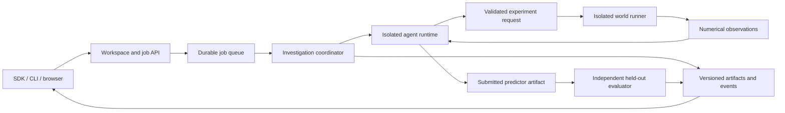

# Implementation plan

Status: proposal. Architecture and infrastructure decisions are being reviewed.
Only planning documents and repository metadata exist at this stage. See
[open design decisions](DESIGN_DECISIONS.md) before treating a choice below as final.

## Objective

Build an extensible production research platform around this question:

> Under a fixed number of interventions, which experiment-selection strategies
> learn predictive rules that generalize, and recover when those rules change?

Research correctness takes priority over interface breadth. A negative result for
the LLM is a valid outcome. Do not design the suite to make one method win.

The target user is a research engineer integrating an agent, running a controlled
investigation, and diagnosing failures. The product must support external teams,
private studies, durable remote execution, and independent deployment. The browser
is a client of the same research interfaces available to the SDK and CLI.

## Scope of version 0.1

- Two-dimensional motion in dimensionless units with up to eight interacting
  particles. Include single-particle and fixed-anchor reference cases for
  numerical and identification checks. Exact interaction semantics remain under
  review; collisions are not required by the accepted scope.
- Three families with hidden coefficients, including terms that may be absent.
- Visible particle identities, masses and connections; active force laws,
  coefficients and realized change times remain hidden.
- Agent-selected initial positions, velocities and masses, with at most one
  initial impulse. Continuous control is a separate future track.
- Numerical position and velocity observations with controlled sensor noise.
- Default scored budget of 40 experiments including four common calibration
  experiments, with configurable budgets for custom studies.
- A stationary control condition and at most one unannounced
  change between experiments. Resetting the particle does not reset the law.
- Primary scores measure held-out prediction error and recovery after changes;
  exact equation recovery is a secondary diagnostic.
- Agent discovery with executable predictive models, plus a separate controlled
  comparison of three selectors sharing a model fitter and adaptation policy.
- Python SDK, CLI, hosted service, versioned run records, and a live browser
  investigation/replay interface. Support self-hosted deployment.
- Durable remote jobs with checkpoints, cancellation, bounded retries and quotas.
- Isolated execution of user-supplied agents and predictors; private customer
  investigations and explicit artifact publication.
- A constrained world builder: supported primitives and coefficient ranges.
  Extend law families through a versioned plugin contract without core changes.

Approved organizations can use the hosted service; the SDK and self-hosting stay
public. Uploaded agents and predictors initially target Python, while externally
hosted agents can use HTTP. Hosted code has no unrestricted internet access;
model calls use a broker and dependencies come from prepared environments.

The first production deployment targets Google Cloud and 100 simultaneous
investigations. Provider selection does not settle service configuration or
prove capacity. See the [deployment design](DEPLOYMENT_OPTIONS.md).

## Architecture

The Python simulator is the sole authority on physics. The eventual browser
interpolates recorded frames; it does not implement a second physics engine.

### Core and contracts

Keep the initial package small: dataclasses, a force-law interface, fixed-step
RK4, a budget-enforcing session, and seeded random exploration. Add NumPy and
SciPy when implementing fitting. Keep all dependencies locked with uv.

Use the same typed, versioned messages across local and remote execution. Separate
the coordinator, simulator, agent runtime and evaluator. Agent code must not
receive hidden configurations, evaluator files, seeds that reconstruct worlds,
or filesystem access to them. A Python private attribute or ordinary same-host
process is not sufficient isolation for hostile code in a shared hosted service.

Submit immutable agent, law and predictor packages with pinned dependencies and
content hashes. Evaluate predictors in a fresh restricted environment. Provide
only the inputs required for prediction, no true outputs or evaluator credentials,
and do not return held-out evaluation feedback during the investigation.

Proposed agent-facing operations:

- `describe_space()` returns legal interventions, units, timing and budget.
- `run_experiment(spec)` returns timestamped observations and remaining budget.
- `fit_model()` is available in the controlled track and uses only purchased data.
- `predict(spec)` evaluates a submitted model, never the true simulator.
- `submit_model()` commits a predictor artifact for independent evaluation.

Each selected experiment includes a concise, workspace-visible rationale and optional
testable hypothesis. Treat these as annotations, not evidence of correctness.

### Production execution

Begin with one application service and independently scalable workers. Use durable
job state, an append-only event record, and immutable objects for bulk artifacts.
The selected service mapping is Cloud Run for trusted services, a separate GKE
Sandbox execution tier, Cloud SQL PostgreSQL for state, Cloud Storage for artifacts
and Cloud Tasks for dispatch. Use separate development and production projects.
Detailed cloud configuration remains under review. Implement managed OpenID
Connect login, explicit invitations and owner/researcher/viewer roles before
accepting private hosted studies. A matching email domain never grants membership.

Accept Python packages with lockfiles and build immutable runtime images in
isolated build environments. Uploaded package build hooks are user code and must
not execute in a trusted deployment pipeline with production credentials.

Record experiment identity and the committed result before acknowledging success.
Use idempotency keys and reconcile incomplete attempts after a crash so retries
cannot create a second logical experiment or platform charge. External model
requests have separate attempt records: an ambiguous provider response may have
incurred cost, so do not promise exactly-once external billing or blindly retry it.

Checkpoint declared agent state after each committed experiment using an explicit
SDK contract; do not promise transparent continuation of arbitrary process memory.
See the [checkpoint contract](CHECKPOINTS.md). Preserve accepted experiments and
submitted predictors across worker failure. Make cancellation, deadline expiry,
partial completion and failed runs visible terminal states.

Track model usage and resource consumption with configurable run/workspace limits.
Customer-supplied credentials must stay outside user-code runtimes and public
artifacts. Budget is not a reason to reduce the accepted product scope, but no
unbounded infrastructure or model sweep is authorized by this plan.

### Inference

Use sparse regression over a disclosed feature dictionary and fit integrated
velocity increments to avoid numerically differentiating noisy observations.
Choose regularization and numerical settings on development worlds. For radial
fields, compare a small, disclosed exponent grid; do not secretly give the fitter
the correct exponent. Use bootstrap resampling of whole experiments for an
ensemble, since samples within a trajectory are correlated.

In the controlled track, selectors share that fitter, its feature library, its
fit budget and its change-handling policy. Ensemble disagreement is an acquisition
heuristic; predictive interval coverage must be measured rather than assumed.

The agent-discovery track accepts executable predictor artifacts inside the
isolated execution contract. Agents may propose and fit different model classes.
Report this track separately because changing both selection and model class
does not isolate the causal effect of experiment selection. The sandbox must
enforce runtime/output limits and numerical validation independently of the agent.

### Adaptation

Use standardized pre-experiment prediction residuals to update a change detector.
After a validated alarm, reset or down-weight old observations according to a
predeclared policy. Implement an all-history policy, a fixed sliding window, and
a detector-triggered reset as explicit ablations, not ad hoc rescues.

Calibrate detector thresholds and interval construction on development worlds,
including stationary controls. A true change marker exists only in evaluator
metadata and becomes visible to people in the completed replay.

### Viewer and world builder

Use TypeScript, React, Vite and Canvas 2D when the replay format settles. Begin
with file import and bundled, clearly labeled example runs. The first screen
shows actual and predicted trajectories, uncertainty bands, budget, public
hypotheses and the current experiment. The timeline supports play, pause, scrub,
speed controls and synchronized strategy comparison.

A builder exposes coefficients and a hidden-change schedule. The agent receives
only the resulting observation API. The hosted service streams committed events
to the browser; reconnects resume from a durable cursor. Local and hosted clients
use the same record schema. Keep private data behind workspace authorization and
make publication an explicit action. Show hypotheses and uncertainty as model
outputs rather than scientific ground truth.

## Milestones and acceptance gates

| Milestone | Deliverable | Completion gate |
| --- | --- | --- |
| M0 — contracts and physics | Finalized architecture, SDK contracts, law plugins, deterministic simulator and CI | External code can add a law and agent without core changes; physical/protocol tests pass. |
| M1 — research evaluation | Fitter, predictor interface, held-out evaluator and two evaluation tracks | Known recoverable cases fit accurately; evaluation data cannot leak; metrics reproduce from stored artifacts. |
| M2 — durable execution | Hosted API, authentication, workspace permissions, queue, isolated workers and checkpointing | Crash recovery, cancellation, duplicate requests, egress/isolation and cross-workspace access tests pass. |
| M3 — agent integration | Model gateway, executable predictor packages, provider adapter, customer credentials and usage accounting | Full investigations run locally and remotely; provider failures and ambiguous retries have explicit outcomes. |
| M4 — research workspace | Live investigation, world builder, replay, comparison, import/export and self-hosting | External team can run a private study, inspect failures, export it and deploy independently. |
| M5 — production and reference release | Frozen evaluation, complete reference artifacts, deploy/upgrade/restore procedures and observability | Publish all scored runs; pass the agreed load and recovery tests; complete an outside-team integration. |

Build in dependency order. All milestones are pending. M1 and M2 can progress
independently once M0 contracts settle. A production release requires the entire
set of gates, not merely an animated investigation. Estimate effort after initial
simulation, sandbox and provider measurements.

## Tests and release gates

- Physics: force direction, rotational symmetry where applicable, dissipative
  drag, force/mass scaling, softened-field finiteness, reference oscillator and
  timestep convergence. Do not enforce energy conservation on dissipative laws.
- Protocol: fixed cost, budget exhaustion, resets preserving the law regime,
  exact change boundary, noise reproducibility, invalid actions and nonfinite
  simulation failures, and no hidden metadata in observations.
- Research: leakage tests, synthetic recovery, prediction serialization,
  stationary false alarms, censored failures and aggregation by independent world.
- Interface: replay schema compatibility and end-to-end replay/scrubbing checks.
- Operations: idempotent requests, worker crashes, cancellation, checkpoint
  restoration, cross-workspace isolation, unavailable dependencies, backup restore
  and the agreed concurrent-job target.
- Quality: Ruff formatting/linting, strict mypy, pytest, and frontend lint/type
  checks when a frontend exists. CI never needs a paid provider key.

## Repository and release workflow

Use one public repository, `spei04/strange-physics`, with a small initial commit
and scoped feature branches thereafter. Record changes in ordinary descriptive
commits and PRs using the existing Git identity. Preserve upstream citations and
licenses if external code is introduced.

Keep this checkout for sequential work. Do not create a checkout for every
milestone. Keep caches outside checkouts, dependencies owned by the checkout,
and large generated runs outside Git. Publish sanitized artifacts for every scored
reference run, including failures. Keep customer studies private by default and
require explicit publication. Provider keys never belong in public artifacts.

Store durable release manifests and needed evidence outside disposable worktrees.
Each manifest identifies commit, task/owner, purpose, config hashes and artifact
hashes. Temporary diagnostics receive a review date, normally 30 days after task
completion. Before retiring a checkout, account for active consumers and migrate
needed records. The active main checkout remains useful for the next milestone.

## Deferred work

Collisions, pixel observations, gradual drift, multiple change points and
reinforcement learning remain proposed follow-up studies. Systems with up to
eight interacting particles and executable predictor submission are accepted
first-release scope.
Add new research conditions with a specific evaluation question and adequate
baselines. No GPU training is required for the first release.
